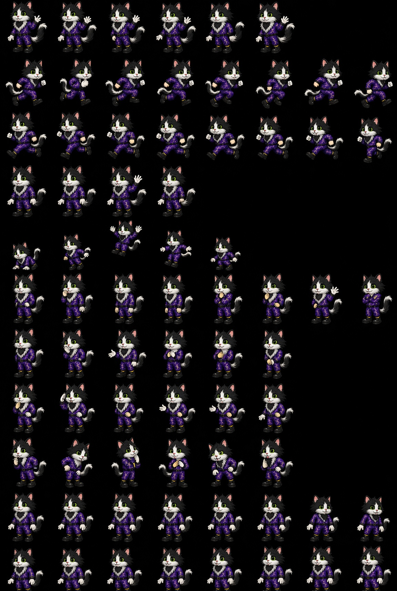

# Dage sprite marking reference

The authoritative Dage visual references are:

- `Dage_Mascot_Idle.png` — primary close reference for coat placement, ruff shape, face, clothing, and tail.
- `Dage_Sprite_Sheet.jpg` — pose reference showing how the same identity reads across movement and expressions.

## Front-neck marking

Dage's irregular black fur patch is on the **front of his neck within the white ruff**. It begins below the jaw and follows the neck fur downward toward the upper chest.

- His muzzle and chin remain white.
- The patch is anchored to the front-neck anatomy and changes perspective with the head and torso.
- It can be partly hidden by the ruff, head angle, paws, or clothing, but it must not migrate onto the chin.
- Do not draw it as a chin spot, beard, bowtie, collar ornament, or floating shader overlay.
- Preserve a natural, uneven fur edge rather than a geometric shape.

Use these two images as visual authority for all new Dage sprites, pose selection, atlas updates, 2D animation, and 3D look development. The transparent production atlas may be used for rendering, but new or revised artwork must be checked against these references before it is approved.
