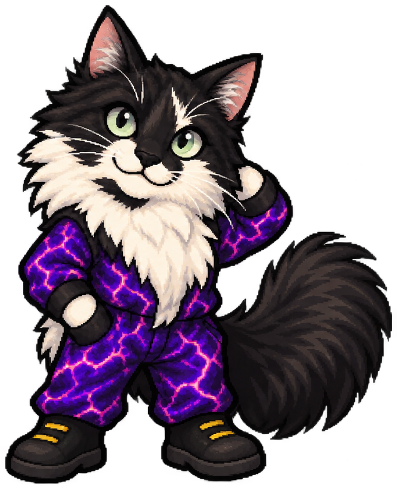
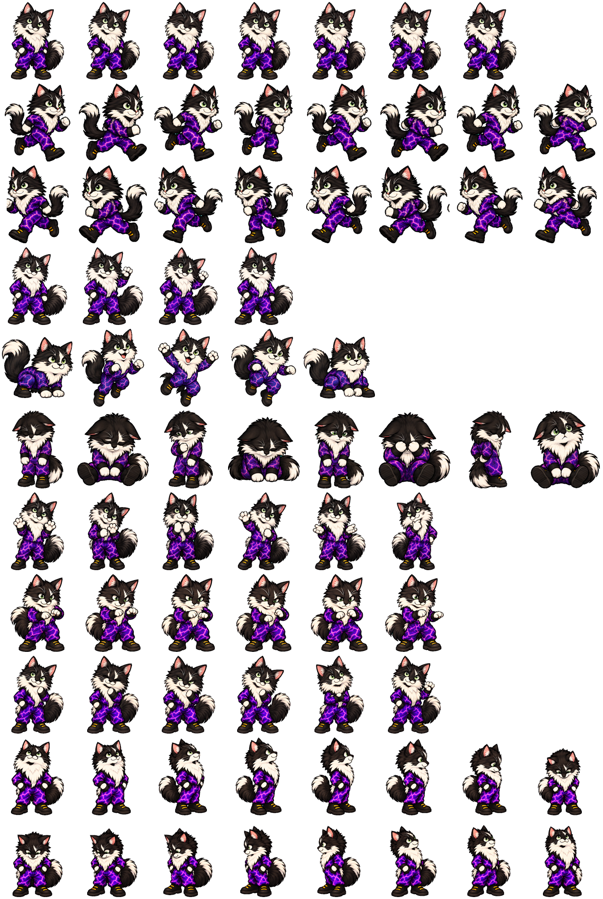

# Dage sprite marking reference

The current Dage source of truth is `Dage_SpriteSheet.png` (8×11, 192×208 cells). The other images are supporting visual references:

- `Dage_Mascot_Idle.png` — close reference for coat placement, ruff shape, face, clothing, and tail.
- `Dage_Sprite_Sheet.jpg` — earlier pose reference.

## Front-neck marking

Dage's irregular black fur patch is on the **front of his neck within the white ruff**. It begins below the jaw and follows the neck fur downward toward the upper chest.

- His muzzle and chin remain white.
- The patch is anchored to the front-neck anatomy and changes perspective with the head and torso.
- It can be partly hidden by the ruff, head angle, paws, or clothing, but it must not migrate onto the chin.
- Do not draw it as a chin spot, beard, bowtie, collar ornament, or floating shader overlay.
- Preserve a natural, uneven fur edge rather than a geometric shape.

Use the approved 8×11 sheet for new Dage pose selection, 2D animation, and rendering. Check new or revised artwork against it and the supporting references. The historical 7×10 atlas is retained only to reproduce completed scenes.
